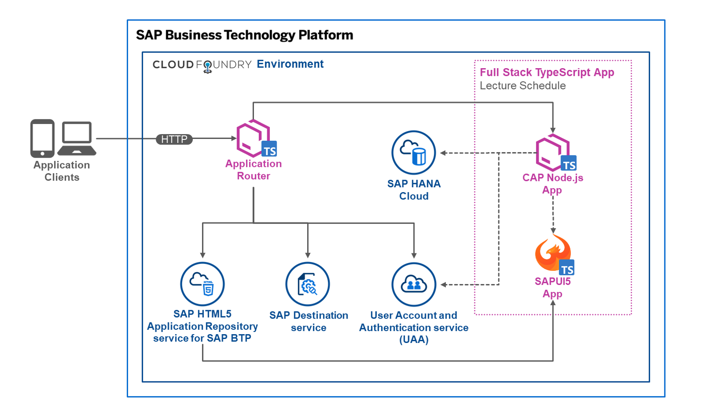

# Full Stack TypeScript App

This sample project is a full stack application for the SAP BTP, Cloud Foundry environment that utilizes the SAP Cloud Application Programming Model (CAP) for Node.js and SAPUI5 with TypeScript.

[TypeScript](https://www.typescriptlang.org/) is a superset of JavaScript, which can essentially be described as JavaScript with syntax for types. The additionally added syntax allows a better editor integration and aims to catch errors early in development.

This project shows a full stack app entirely build with TypeScript. It is based on a basic lecture schedule scenario. The backend service features a simple data model (Rooms, Professors, Courses, Lectures) and provides data to populate a lecture schedule, which is displayed as a planning calendar on the frontend. Users can either view or manage the lecture schedule depending on the roles that are assigned to them.



**UI5 TypeScript Frontend**: A freestyle SAPUI5 app serves as the frontend for the project. Component, Controller, and Formatter are implemented using the perks of TypeScript. If you want to learn more about TypeScript with UI5, have a look at the following resources:

-   [Getting Started with TypeScript for UI5 Application Development](https://blogs.sap.com/2021/07/01/getting-started-with-typescript-for-ui5-application-development/)
-   [Central entry point for everything TypeScript-related in SAPUI5/OpenUI5](https://sap.github.io/ui5-typescript/)
-   [UI5 TypeScript Hello World App](https://github.com/SAP-samples/ui5-typescript-helloworld)

**CAP TypeScript Backend**: The backend service is implemented with CAP Node.js. TypeScript is used to write the service handler for the lecture service. A tsconfig.json file is used to define TypeScript compiler options and configuration. You can find more on using TypeScript with CAP here:

-   [CAP Node.js SDK - Using TypeScript](https://cap.cloud.sap/docs/node.js/typescript)
-   [Hello World! TypeScript sample](https://github.com/SAP-samples/cloud-cap-samples/tree/main/hello)

For a more detailed description of the sample app and takeaways when using TypeScript, please take a look at the accompanying **blog post**: [Full Stack TypeScript App for Cloud Foundry - Sample Repository](https://blogs.sap.com/2021/12/09/full-stack-typescript-app-for-cloud-foundry-sample-repository)

## Requirements

-   [Node.js](https://nodejs.org/en/download/) LTS Version 14
-   [npm](https://www.npmjs.com/) or [yarn](https://yarnpkg.com/) for dependency management
-   install [@sap/cds-dk](https://www.npmjs.com/package/@sap/cds-dk) globally
-   install [@ui5/cli](https://www.npmjs.com/package/@ui5/cli) globally

## Download and Installation

1. Clone the project:

```sh
git clone https://github.com/SAP-samples/btp-full-stack-typescript-app.git
cd btp-full-stack-typescript-app
```

(or download from https://github.com/SAP-samples/btp-full-stack-typescript-app/archive/main.zip)

2. In the btp-full-stack-typescript-app folder, use npm (or yarn) to install the dependencies:

```sh
npm install
```

3. In the app/lectures sub-folder, use npm (or yarn) to install the dependencies:

```sh
cd app/lectures
npm install
```

## Run, Build and Deploy the App

> `npm run start` is for production purposes and **not intended to be used on your local machine**. Since TypeScript code itself cannot be executed, a transpile step to JavaScript is needed before running the project. Choose one of the following options instead to run the app.

### Run the App locally

```sh
npm run start-service:ts
```

The service is now available at http://localhost:4004.

```sh
npm run start-ui:ts
```

The UI5 app is now running on http://localhost:8080/index.html (a browser window with this URL opens automatically).

### Run the App locally in watch mode

```sh
npm run watch
```

This starts a local development server in watch mode. Changes to files (including the uncompiled TypeScript resources) are automatically detected and applied. The CAP service is now available at http://localhost:4004 (a browser window with this URL opens automatically to show the generic index.html page), and the UI5 app can be accessed at http://localhost:4004/webapp/index.html.

### Build the MTA and Deploy to Cloud Foundry

> Additional preparation steps and tools are required to deploy the application to SAP BTP, Cloud Foundry environment. For more information and guidance on the initial setup, please have a look at these tutorials and resources:
>
> -   [Create a trial account on SAP BTP](https://developers.sap.com/tutorials/hcp-create-trial-account.html)
> -   [Create SAP HANA Cloud Service instance](https://developers.sap.com/tutorials/btp-app-hana-cloud-setup.html#08480ec0-ac70-4d47-a759-dc5cb0eb1d58)
> -   [Install Cloud Foundry CLI](https://developers.sap.com/tutorials/cp-cf-download-cli.html)
> -   [Install MultiApps CF CLI Plugin](https://github.com/cloudfoundry-incubator/multiapps-cli-plugin)
> -   [Install Cloud MTA Build Tool](https://sap.github.io/cloud-mta-build-tool/download/)

```sh
mbt build -t ./
```

```sh
cf login
cf deploy lecture-schedule_1.0.0.mtar
```

## Limitations

-   The local database uses in-memory mode. Data will be re-initialized after each restart.
-   The provided sample data only covers a specific timeframe (CW47/2021 to CW05/2022)
-   The user role check for UI adjustments is based on the standalone approuter and BTP roles. Therefore it is not available when running the app locally.

## Known Issues

None at the moment.

## How to obtain Support

This content is provided "as-is" with no other support.

In case you find a bug, please [create an issue](https://github.com/SAP-samples/btp-full-stack-typescript-app/issues) in this repository.

Questions can be [asked in SAP Community](https://answers.sap.com/questions/ask.html).

## License

Copyright (c) 2021 SAP SE or an SAP affiliate company. All rights reserved. This project is licensed under the Apache Software License, version 2.0 except as noted otherwise in the [LICENSE](LICENSES/Apache-2.0.txt) file.
